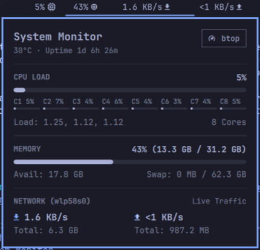

# System Monitor for Omarchy

A native top bar widget and popup overview panel for Omarchy Linux displaying live CPU, RAM, and bandwidth activity.



## ✨ Unique Features & Highlights

- ⚡ **Zero-Dependency Native Collector**: Directly queries Linux `/proc` and `/sys` interfaces with pure POSIX shell and AWK. No Python daemon, Node.js runtime, or background services required (~15–20ms execution per tick).
- 📏 **Jitter-Free Fixed Layout (Zero Horizontal Shift)**: Each top bar metric slot uses calibrated fixed-width containers with right-aligned typography. The bar never shifts, bounces, or resizes when metric digits change length (e.g. going from `9%` to `10%` to `100%` or `<1 KB/s` to `12.5 MB/s`).
- 🌡️ **Accurate CPU Package Temperature**: Automatically prioritizes dedicated CPU hardware sensors (Intel `coretemp`, AMD `k10temp`/`zenpower`, ARM SoC) over generic motherboard/ACPI ambient zones to report exact die temperatures matching `btop`.
- 🔀 **Independent Bar vs. Popup Configuration**: Customize what appears in your top bar pill separately from what is displayed in the popup overview panel (e.g. keep the bar minimal while showing all details in the popup).
- 📐 **Full Metric & Section Reordering**: Freely customize the ordering of metric slots in the top bar pill (`barOrder`) and overview panel sections (`panelOrder`) via simple lists or comma-separated strings.
- 🛡️ **Hardened Architecture & Security**: Producer-side bounding (<= 8KB / 128 lines max), consumer-side core caps (<= 64 cores), control-character sanitization, explicit `Text.PlainText` rendering across all sinks, and a 2.0s process watchdog timer to prevent hung subprocesses.
- ⚡ **Interactive Productivity Shortcuts**: Left-click to inspect full metrics, right-click to instantly launch or focus `btop` in a floating terminal, and middle-click to trigger an immediate metrics refresh.

## 📊 Feature Breakdown

### 1. Top Bar Pill
- **Live Metrics**: CPU usage (%), RAM usage (%), Storage/Home partition (%), Download bandwidth, and Upload bandwidth (`15%    42% 󰍛   44% (68G) 󰋊   1.2 MB/s 󰇚   340 KB/s 󰕒`).
- **Zero Layout Jitter**: Fixed slot widths guarantee neighboring top bar widgets remain perfectly stationary on every refresh tick.
- **Dynamic Orientation**: Seamlessly adapts between horizontal and vertical bar layouts.
- **Threshold Alert Colors**: Color transitions to warning and urgent accent colors when CPU, Memory, or Disk cross configured alert thresholds.
- **Customizable Order**: Rearrange pill slots (e.g. `["disk", "cpu", "memory", "network"]` or `"cpu, memory, network"`).

### 2. Overview Popup Panel (Left-Click)
- **Header Summary**: Real-time CPU die temperature, system uptime, and a quick-launch **`btop`** task manager button.
- **CPU Load Section**: Overall utilization percentage, dynamic progress bar, 1m/5m/15m load averages, core count, and per-core mini load bars (supporting up to 64 cores).
- **Network Section**: Active network interface name, real-time download and upload transfer rates, and cumulative session data transfer totals.
- **Memory & Swap Section**: Used / total RAM, available RAM, and swap space breakdown with visual progress bar.
- **Storage Section**: Primary `$HOME` partition mount path, used / total disk capacity, free space remaining, and utilization progress bar.
- **Section Reordering**: Set any section order you prefer (e.g. `["cpu", "network", "memory", "storage"]`).

### 3. Mouse & Keyboard Shortcuts
- **Left-Click**: Toggle overview popup panel.
- **Right-Click**: Instantly open or focus `btop` in a floating terminal.
- **Middle-Click**: Force immediate metrics refresh.
- **Escape / Tab**: Close popup or cycle between adjacent panels.

## Install

```sh
omarchy plugin add https://github.com/LoupiBe/omarchy-widget-system-monitor.git --enable
```

## Usage

- Click the widget on the top bar to open or close the overview panel.
- Press **Escape** while the panel is open to close it.
- Right-click the widget to open `btop`.

## Configure

### Bar Positioning

Place the widget in your preferred bar section (e.g. `left`, `center`, `right`):

```sh
omarchy bar move io.github.loupibe.system-monitor --section left
```

### Options & Customization

The widget can be fully customized in `~/.config/omarchy/shell.json`:

```json
{
  "id": "io.github.loupibe.system-monitor",
  "refreshIntervalSec": 2,
  "showCpu": true,
  "showGpu": false,
  "showMemory": true,
  "showDisk": false,
  "showNetwork": true,
  "showTemp": false,
  "barOrder": ["cpu", "memory", "disk", "network"],
  "panelShowCpu": true,
  "panelShowGpu": false,
  "panelShowMemory": true,
  "panelShowDisk": true,
  "panelShowNetwork": true,
  "historyStyle": "sparkline",
  "historyPoints": 20,
  "showCpuHistory": true,
  "showNetworkHistory": true,
  "showMemoryHistory": false,
  "showDiskHistory": false,
  "showGpuHistory": false,
  "panelOrder": ["cpu", "memory", "storage", "network"],
  "cpuAlertPercent": 85,
  "gpuAlertPercent": 85,
  "memAlertPercent": 85,
  "diskAlertPercent": 90
}
```

| Setting | Type | Default | Description |
|---|---|---|---|
| `refreshIntervalSec` | integer | `2` | Update interval in seconds (1 to 10). |
| `showCpu` | boolean | `true` | Show or hide CPU load percentage in the top bar pill. |
| `showGpu` | boolean | `false` | Show or hide GPU load percentage in the top bar pill. |
| `showMemory` | boolean | `true` | Show or hide RAM percentage in the top bar pill. |
| `showDisk` | boolean | `false` | Show or hide Storage (Disk) % & free space in the top bar pill. |
| `showNetwork` | boolean | `true` | Show or hide download/upload bandwidth in the top bar pill. |
| `showTemp` | boolean | `false` | Show or hide CPU temperature in the top bar pill alongside CPU %. |
| `barOrder` | list / string | `["cpu", "memory", "disk", "network"]` | Custom order of metric slots on the top bar pill (`cpu`, `gpu`, `memory`, `disk`, `network`). |
| `panelShowCpu` | boolean | `true` | Show or hide the CPU section in the overview popup panel. |
| `panelShowGpu` | boolean | `false` | Show or hide GPU load meter and VRAM inside the CPU panel in the overview. |
| `panelShowMemory` | boolean | `true` | Show or hide the Memory section in the overview popup panel. |
| `panelShowDisk` | boolean | `true` | Show or hide the Storage section in the overview popup panel. |
| `panelShowNetwork` | boolean | `true` | Show or hide the Network section in the overview popup panel. |
| `historyStyle` | string | `"sparkline"` | Style for timeline history graphs (`"sparkline"`, `"bars"`, `"area"`). |
| `historyPoints` | integer | `20` | Number of history sample points to keep in timeline (5 to 60). |
| `showCpuHistory` | boolean | `true` | Show timeline sparkline/graph in the CPU overview section. |
| `showNetworkHistory` | boolean | `true` | Show timeline sparkline/graph for download/upload in Network section. |
| `showMemoryHistory` | boolean | `false` | Show timeline sparkline/graph in the Memory overview section. |
| `showDiskHistory` | boolean | `false` | Show timeline sparkline/graph in the Storage overview section. |
| `showGpuHistory` | boolean | `false` | Show timeline sparkline/graph in the GPU overview section. |
| `panelOrder` | list / string | `["cpu", "memory", "storage", "network"]` | Custom order of sections in the popup overview panel. |
| `cpuAlertPercent` | integer | `85` | CPU % threshold to trigger urgent alert color (50 to 99). |
| `gpuAlertPercent` | integer | `85` | GPU % threshold to trigger urgent alert color (50 to 99). |
| `memAlertPercent` | integer | `85` | Memory % threshold to trigger urgent alert color (50 to 99). |
| `diskAlertPercent` | integer | `90` | Disk % threshold to trigger urgent alert color (50 to 99). |

## Remove

```sh
omarchy plugin remove io.github.loupibe.system-monitor
```

## Dependencies

- **Linux `/proc` & `/sys`**: Used by `stats.sh` for lightweight, zero-dependency metrics collection (standard on all Linux systems).
- **`btop`** *(optional)*: For the quick-launch task manager action (standard in Omarchy).
- **Nerd Font**: For bar glyphs and panel icons (standard in Omarchy).

## License

MIT © 2026 LoupiBe
